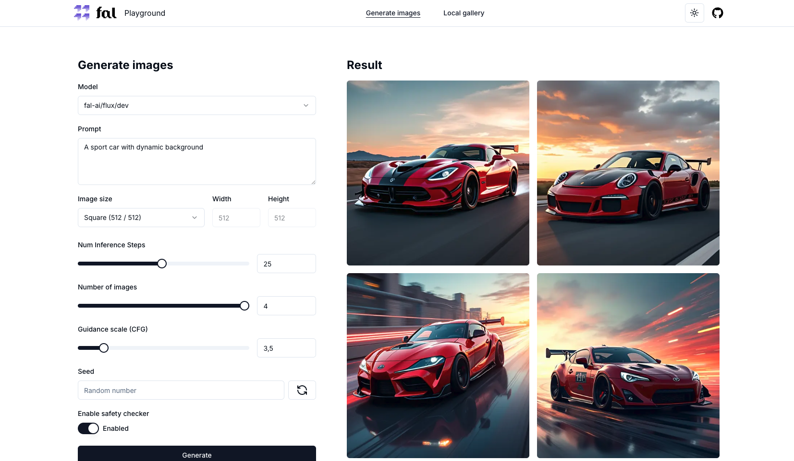
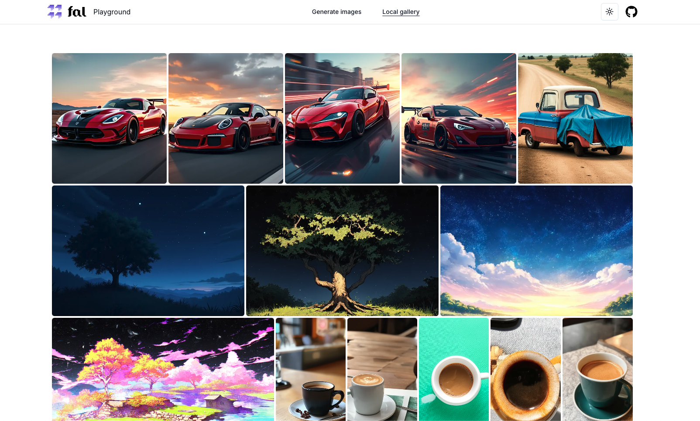
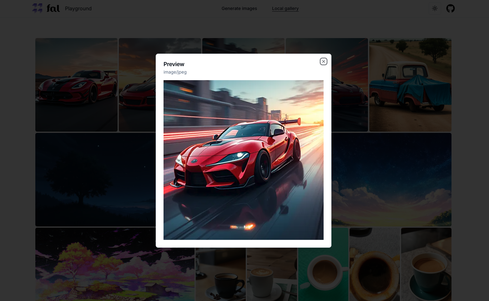

This is a [Next.js](https://nextjs.org/) project bootstrapped with [`create-next-app`](https://github.com/vercel/next.js/tree/canary/packages/create-next-app).

# Fal.ai playground Next.js (14+)







## Features

- Generate images via fal.ai API without any limitations
- All results are stored in local gallery via local storage

## Requirements

- Node.js  20+

## Getting Started

First, create a new env file 
```bash
cp .env .env.local
```

Add your `FAL_KEY` (refer to your API dashboard to generate this key [here](https://fal.ai/dashboard/keys)). 

Run the development server:

```bash
npm run dev
```

Open [http://localhost:3000](http://localhost:3000) with your browser to open the app.

## Supported models so far:

- `fal-ai/aura-flow`
- `fal-ai/flux/dev`
- `fal-ai/flux`
- `fal-ai/flux/schnell`
- `fal-ai/flux-pro`
- `fal-ai/stable-diffusion-v3-medium`

### TODO

- Dynamic form depends on model requirements
- Support for other fal.ai tools like video or sound generator 
